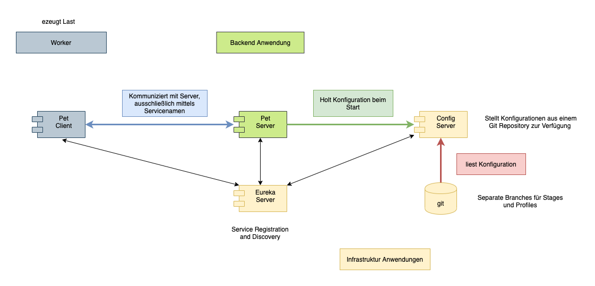

# pet-client
A Spring Boot showcase demonstrating how to operate the pet-server via Spring Cloud infrastructure.

Overview

Showcase is built on [Swagger Petstore](https://petstore.swagger.io/) openAPI example.